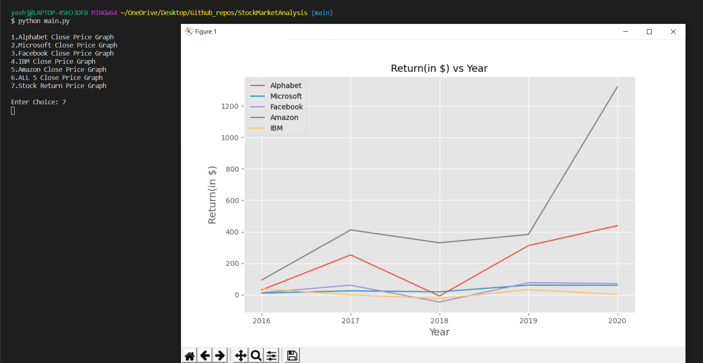
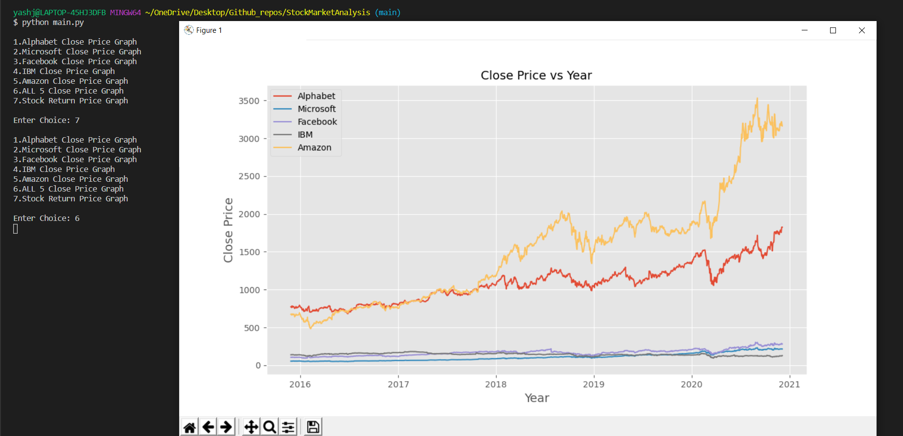

# STOCK MARKET ANALYSIS

> Line chart of stock returns over time of any 5 companies from the data of 5 years using Yahoo Finance 

# Technologies Used

> Python 
> Pandas and Pandas Datareader 
> Matplotlib 
> YFinance 

# Features

> Line Chart of individual companies closing price 
> Line Chart of all 5 companies closing price together for comparison 
> Line Chart on the return received from each of the 5 companies

# Screenshots

<h2 align="center">Line Chart For Returns</h2>

 

<h2 align="center">Line Chart For All 5 Companies Closing Price</h2>

 

<h2 align="center">Line Chart For Closing Price For TCS</h2>

 

## App Info

### Author [Yash Jhaveri](https://www.linkedin.com/in/yash-jhaveri-3b0882192/)